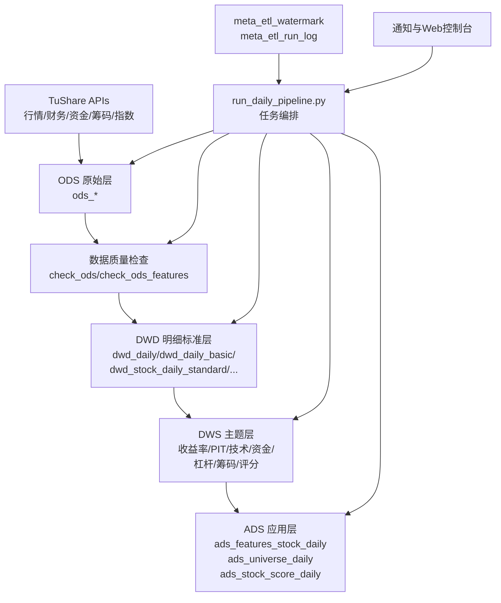

# 项目代码评审：业务架构、数据处理逻辑与数据流

## 1. 项目定位与业务架构

该项目本质是 **A 股日频选股数据底座 + 因子评分计算平台**，核心业务目标是：

1. 从 TuShare 拉取多源行情/财务/资金/筹码数据。
2. 通过分层数仓（ODS → DWD → DWS → ADS）沉淀可复用数据资产。
3. 输出可直接服务策略/选股/回测的特征与评分结果。
4. 通过每日增量总控脚本保障“采集-加工-校验-告警”的闭环。

从代码实现上可划分为 5 个业务域：

- **数据接入域**：`scripts/sync/run_ods.py`、`scripts/sync/run_ods_features.py`、`scripts/sync/run_index_suite.py`。
- **数据建模域**：`scripts/sync/run_dwd.py`、`scripts/sync/run_dws.py`、`scripts/sync/run_ads.py`。
- **任务编排域**：`scripts/sync/run_daily_pipeline.py`。
- **运行保障域**：`scripts/check/*.py` + `meta_etl_watermark` / `meta_etl_run_log`。
- **服务与可视化域**：`scripts/run_web.py`（手动触发、定时管理、运行观察）。

## 2. 分层职责与产出

### 2.1 ODS（原始层）

- 通过 TuShare API 直接入库，保留接近源数据形态。
- 支持行情、财务、资金流、筹码、技术因子、指数专题等多数据簇。
- 采用 `ON DUPLICATE KEY UPDATE`，保障幂等写入。

### 2.2 DWD（明细标准层）

- 对 ODS 数据进行字段标准化与质量兜底（如极值处理）。
- 构建前复权标准行情 `dwd_stock_daily_standard`，供技术因子统一计算。
- 形成财务快照、融资情绪、筹码稳定性、股票标签等可分析明细主题。

### 2.3 DWS（主题汇总层）

- 构建收益率、PIT 财务、技术形态、资金行为、杠杆情绪、筹码动态等主题宽表。
- 在主题层计算多套评分（Claude/Fama/扩展因子），用于多策略并行评估。

### 2.4 ADS（应用服务层）

- 产出统一特征服务表 `ads_features_stock_daily`。
- 产出可交易股票池 `ads_universe_daily`。
- 产出综合评分 `ads_stock_score_daily`，支撑最终选股排序。

## 3. 数据处理逻辑（按执行链路）

### 3.1 每日增量主流程

`run_daily_pipeline.py` 的标准顺序：

1. ODS 增量采集。
2. ODS 完整性检查。
3. ODS 特征采集（含 T-1 扩展以覆盖两融 T+1 可得问题）。
4. 指数专题增量同步 + 检查。
5. （可选）财务窗口增量与财务新鲜度检查。
6. DWD 增量加工 + 检查。
7. DWS 增量加工 + 检查。
8. ADS 增量加工 + 检查。
9. 汇总执行耗时，按配置发送通知。

该流程体现了 **“先采后算、层层校验、失败即停”** 的工程化原则。

### 3.2 核心处理机制

- **水位驱动**：各层通过 watermark 决定增量区间，避免重复全量扫描。
- **交易日驱动**：统一以交易日历表计算待处理日期，减少自然日噪声。
- **幂等写入**：核心入库均使用 UPSERT，支持失败重跑。
- **可观测性**：run_log + check 脚本形成“状态、时效、完整性”三重监控。
- **速率控制与重试**：对外部 API 统一限流（RateLimiter）并内置重试退避。

## 4. 数据流图

## 5. 架构评审结论

### 5.1 优点

- 分层清晰，职责边界明确，符合数仓建模常规。
- 编排脚本流程完整，具备检查与告警闭环。
- 交易日历 + 水位机制使增量逻辑可控。
- DWS/ADS 具备策略可消费语义，落地性强。

### 5.2 主要风险点（基于代码现状）

1. **SQL/逻辑集中在 runner 中**：维护成本随主题增多会快速上升。
2. **部分领域耦合偏高**：如 DWD 直接依赖 DWS PIT 表（跨层依赖需持续治理）。
3. **数据契约显式化不足**：字段变更与兼容策略更多依赖脚本约定。
4. **历史回补运行成本可能较高**：窗口函数和宽表联接在长区间回灌时压力较大。

### 5.3 建议优化方向

- 将主题 SQL 模块化（按领域拆分 SQL 文件 + 参数化执行）。
- 补充“层间数据契约文档”（主键、刷新频率、字段血缘）。
- 对 DWS/ADS 大窗口任务增加批次切分 + 并发策略基线。
- 引入统一数据质量规则清单（必填率、空值率、波动阈值、延迟阈值）。

## 6. 快速阅读入口（建议顺序）

1. `README.md`：全局结构与表分层。
2. `scripts/sync/run_daily_pipeline.py`：主执行链。
3. `scripts/etl/base/runtime.py`：配置、DB 会话、限流、水位公共能力。
4. `scripts/etl/dwd/runner.py`、`scripts/etl/dws/runner.py`、`scripts/etl/ads/runner.py`：核心加工逻辑。
5. `scripts/check/`：运行保障与质量检查。

